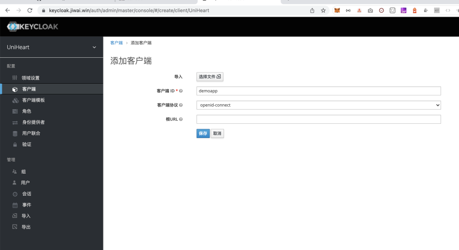

# keycloak-springboot

---

> 演示如何在 Spring Boot 应用中集成 Keycloak

## 在线访问

### 公开的页面，不需要登录即可查看：

- https://tranquil-plains-58233.herokuapp.com/

### 受保护的页，需要经过 Keycloak 登录后才能查看：

- https://tranquil-plains-58233.herokuapp.com/visitor

### 受保护的页（API），经过 Keycloak 登录后，可以将 token 传递给其他页面（不推荐）

- https://tranquil-plains-58233.herokuapp.com/visitor?returnUrl=http://www.baidu.com  这是一个例子，通过传递一个 returnUrl，访问该 API 会被要求登录。登录完成后，token 信息会被重定向传给 returnUrl （比如 http://www.baidu.com ）。你可以传递给自己的前端站点，并接收 token 信息保存，以便后续向 API 发送请求时带上它。推荐参考后面列出的专栏来解决前后端分离的项目中，如何保护 API 的做法，本接口示例仅演示另一种可能性。

https://github.com/Jeff-Tian/keycloak-springboot/assets/3367820/f70162f5-fc00-4708-89a6-ff9023e0846d


## 本地开发

### Mac OSX:

```shell
git clone https://github.com/Jeff-Tian/keycloak-springboot
cd keycloak-springboot
mvn clean install
mvn spring-boot:run -f pom.xml

open http://localhost:8080
open http://localhost:8080/visitor
```

### Windows

```shell
git clone https://github.com/Jeff-Tian/keycloak-springboot
cd keycloak-springboot
mvnw clean install
mvnw spring-boot:run -f pom.xml

start http://localhost:8080
start http://localhost:8080/visitor
```

### 本地运行排障指南

#### Mac OSX 上 `mvn clean install` 报错：

```shell
The JAVA_HOME environment variable is not defined correctly,
this environment variable is needed to run this program.
```

**Solution**

运行 `mvn` 时指定 JAVA_HOME 环境变量：

```shell
JAVA_HOME=/usr/local/opt/openjdk mvn clean install
```

#### Windows 10 上 `mvnw clean install` 报错：

```
[ERROR] Failed to execute goal org.apache.maven.plugins:maven-compiler-plugin:3.8.1:compile (default-compile) on project keycloak-springboot: Compilation failure
[ERROR] No compiler is provided in this environment. Are you running on a JRE rather than a JDK?
```

**Solution**

1. 安装 jabba
    1. 直接 `scoop install jabba` 或者使用官网提供的方式。
    2. 由于 jabba 官网提供的方式，在网络不好时，不可行。所以需要一些变通。
    3. 从 GitHub 上下载 jabba 可执行文件到本地，然后在本地相同目录中运行：
       ```shell
       python3 -m http.server
       ```
    4. 如果是 Windows 10，在 Powershell 中运行：
        ```powershell
        [Net.ServicePointManager]::SecurityProtocol = [Net.SecurityProtocolType]::Tls12
        Invoke-Expression (
          Invoke-WebRequest https://jiy.coding.net/p/jabba/d/jabba/git/raw/master/install.ps1?download=false -UseBasicParsing
        ).Content
        ```
2. 安装 jdk 13
   ```
   jabba install openjdk@1.13.0-2
   ```
3. 解决

## 环境变量

在自动化创建用户时，使用了 Keycloak Admin 接口，
要获取 Keycloak Admin 的访问令牌，就需要 Keycloak
Admin 的用户名和密码。它们不能明文放在代码里，因此采用了
环境变量动态注入。这两个环境变量分别是：

- KC_ADMIN
- KC_PASSWORD

如果你使用自己的 Keycloak 实例，就需要把你自己的 Keycloak
的 Admin 用户名和密码设置在环境变量里。

代码详见： `KeycloakHelper.getAdminAccessToken()`

## Keycloak 配置

要接入 Keycloak，需要在 Keycloak 的相关领域下创建客户端。
比如对于本示例应用，可以在 Keycloak 里创建一个 demoapp
的客户端，如下图所示：

### 命名并保存



### 配置回调域名

可以配置多个，并且支持通配符。

.png)

### 配置一个角色

配合代码配置，可以做到只有该角色的用户才能访问被保护页面。

.png)

## 视频讲解

- https://www.zhihu.com/zvideo/1486055107167514624

## 相关专栏

- [Free Arch: 如何在 Spring Boot 应用中集成 Keycloak？ - Jeff Tian的文章 - 知乎](  https://zhuanlan.zhihu.com/p/480816990)
- [使用 Keycloak 接管 SpringBoot 应用的用户认证功能 - Jeff Tian的文章 - 知乎](  https://zhuanlan.zhihu.com/p/587831808)
- [使用 IdentityServer 保护 Web 应用（AntD Pro 前端 + SpringBoot 后端） - Jeff Tian的文章 - 知乎](https://zhuanlan.zhihu.com/p/533197284)
- [升级 spring-security-oauth2 到 spring-boot-starter-oauth2-resource-server - Jeff Tian的文章 - 知乎](https://zhuanlan.zhihu.com/p/623303771)

## 💵 了解更多

欢迎来知乎向我[咨询](https://www.zhihu.com/consult/people/1073548674713423872)！

<a href="https://www.zhihu.com/consult/people/1073548674713423872" target="blank"></a>

## ✨ Star 历史


